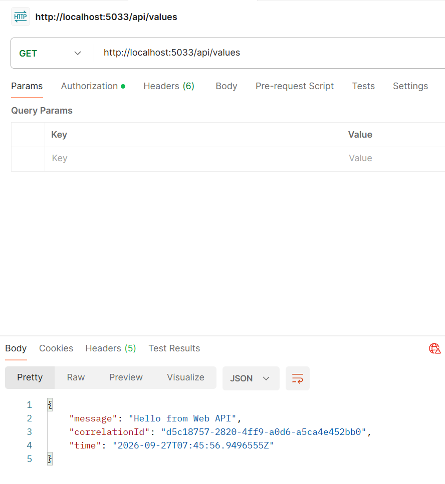
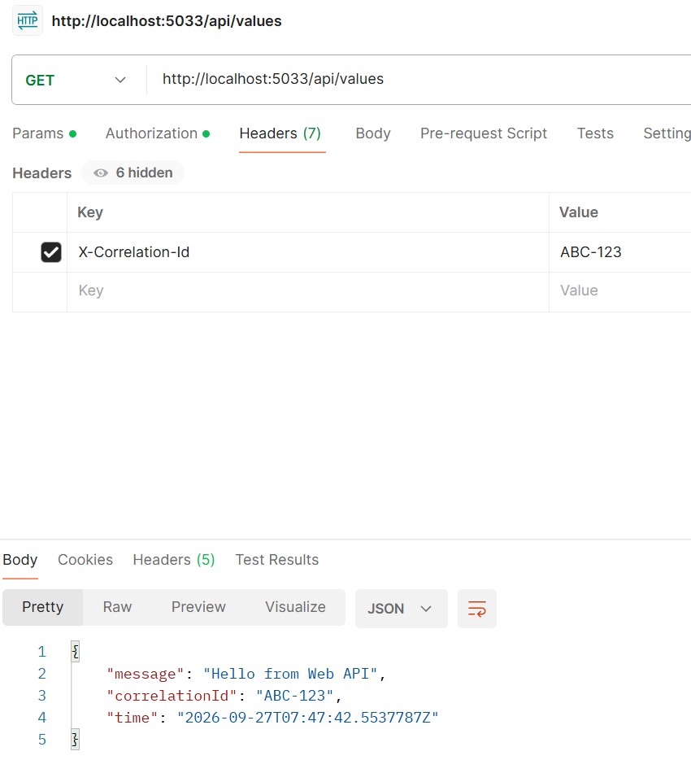

# CorrelationId Demo

Below are two simple screenshots showing the API response before and after adding the X-Correlation-Id header.

## Before adding X-Correlation-Id

The API returns a generated correlationId when no header is provided.

## After adding X-Correlation-Id

When you add the header `X-Correlation-Id: ABC-123`, the API returns the same correlationId value in the response.

Place the two screenshots in the `images/` folder with the names `before.png` and `after.png`.
